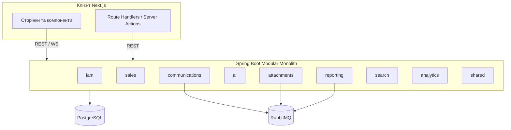
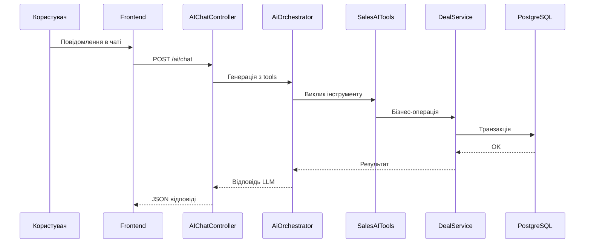

# Звіт про практику

**За темою бакалаврської кваліфікаційної роботи:**  
*«Розроблення CRM-системи для малого бізнесу з інтегрованим LLM-асистентом та підтримкою MCP-протоколу»*

| Поле | Значення |
|------|----------|
| Виконав | [ПІБ студента] |
| Група | [шифр групи] |
| База практики | [повна назва підприємства / підрозділу, місто] |
| Керівник практики від бази | [ПІБ, посада] |
| Керівник практики від ЗВО | [ПІБ, посада] |
| Термін практики | [дати] |
| Рік | [2025/2026] |

> **Примітка щодо попередньої версії звіту.** Файл «Звіт до практики.docx» із завантажень у середовище імпорту не піддається; структура цього документа відтворена за вашою методичною вимогою (вступ, два розділи, висновки, література). Опис предметної області, стеку технологій і реалізованої системи узгоджений із проєктом **aiCRM** у даному репозиторії та файлами `backend/aicrm/ARCHITECTURE.md`, `frontend/ARCHITECTURE.md`.

---

## Вступ

У сучасному малому бізнесі клієнтські бази, угоди й комунікації розкидані між таблицями, месенджерами та поштовими клієнтами, що призводить до втрат лідів, дублювання записів і зайвої ручної праці. Комерційні CRM часто дорогі, перевантажені функціями або погано підлаштовані під типові процеси малої команди продажів. Паралельно зріє використання великих мовних моделей (LLM) не лише як «чату», а як компонента, який може виконувати дії в інформаційних системах через інструменти (tool calling) та відкриті протоколи взаємодії, зокрема **Model Context Protocol (MCP)**.

Актуальність теми підсилюється потребою **поєднати класичні CRM-функції** (контакти, воронка, задачі, аналітика) з **контекстним асистентом**, здатним за запитом користувача зчитувати й оновлювати дані в межах безпеки, та з можливістю **зовнішньої інтеграції** через MCP-сумісний шар для агентів і сторонніх IDE-клієнтів на перспективу.

Мета роботи на етапі практики — **перевірити інженерні рішення** бакалаврського проєкту в умовах реальної або наближеної до виробничої розробки: узгодити вимоги, уточнити архітектуру модульного бекенду та клієнтського застосунку, впровадити ключові домени даних і сценарії інтеграції з каналами комунікації, забезпечити основу для LLM-асистента з tool calling та зафіксувати напрями під MCP.

**Завдання практики (виконано в обсязі розроблення прототипу / робочої версії системи):**

1. Проаналізувати типові процеси продажів і роботи з клієнтами малого бізнесу як предметну область для CRM.
2. Оглянути літературні й нормативно-методичні джерела щодо CRM, архітектури веб-систем та інтеграції LLM.
3. Обґрунтувати технічний стек серверної та клієнтської частини, засобів зберігання даних і асинхронної обробки.
4. Розробити вимоги до системи й основних модулів; закріпити функціонально-структурну модель та потоки даних.
5. Реалізувати клієнтську частину (Next.js): дашборд, клієнти, угоди, Kanban, комунікації, звіти тощо з урахуванням багатоконтекстності (організація / проєкт).
6. Реалізувати серверну частину (Spring Boot) за принципом модульного моноліту: IAM, продажі, комунікації, AI, вкладення, звіти, пошук.
7. Налаштувати базу PostgreSQL, при потребі — розширення для векторів; підготувати інтеграцію з RabbitMQ для фонових задач.
8. Забезпечити роботу глобального LLM-чату з доступом до бізнес-операцій через інструменти (аналог функціональних можливостей MCP-наближеної архітектури в застосунку).
9. Підготувати контрольні сценарії й опис засобів перевірки працездатності.

**Коротка характеристика розділів звіту.** У **розділі 1** наведено характеристику бази практики прив’язану до задач дипломної теми, огляд джерел і обґрунтування підходів. У **розділі 2** формалізовано вимоги до системи, наведено схеми та опис входів/виходів, тестові сценарії. Завершує документ блок **загальних висновків** і **список літератури**.

---

## Розділ 1. Теоретичні засади та узгодження з базою практики

### 1.1. Короткий опис бази практики стосовно завдань бакалаврської кваліфікаційної роботи

[Цей підрозділ заповнюється індивідуально. Орієнтовний зміст — 1–2 сторінки.]

**Шаблон змісту (замість загальних фраз із сайту компанії):**

- організаційна структура підрозділу, де проходила практика, і місце ІТ або цифровізації процесів;
- як саме створювались або велись записи про клієнтів і угоди до появи узгодженої системи (таблиці, Excel, пошта, месенджери);
- які **конкретні болі** було зафіксовано під час практики (наприклад: відсутність єдиної історії дотику з клієнтом, ручний перенос даних між каналами, брак нагадувань по задачах);
- як ці спостереження **перекладено у вимоги** до власної CRM-демонстрації: облік контактів, воронка, задачі, нотифікації, звіти.

Таким чином зв’язок «база практики — дипломна тема» виявляється не через рекламний опис роботодавця, а через **узгодження проблем малого бізнесу з переліком реалізованих модулів** у системі aiCRM.

### 1.2. Огляд літературних джерел

#### 1.2.1. Характеристика предметної області (CRM та малі продажові команди)

**Customer Relationship Management** у широкому сенсі — це стратегія та набір процесів і інструментів для залучення, утримання клієнта та підвищення прибутку з бази контактів. Для малого бізнесу характерні: невелика кількість ролей, поєднання функцій продавця й менеджера, висока швидкість реакції на звернення, обмежений бюджет на софт. Отже типова модель доменних сутностей включає **контакт/клієнт**, **угоду з етапом воронки**, **активність/події**, **задачі** та **комуннікаційні канали**.

Сучасні тенденції додають два шари: **омніканальність** (єдина точка роботи з email і месенджерами) та **розширені можливості аналітики**. Разом з цим збільшується складність налаштувань. Розробка власної CRM з відкритим кодом під конкретну тематику навчальної роботи дозволяє **демонструвати повний цикл** — від доменної моделі до UI та інтеграцій.

#### 1.2.2. Середовища та засоби розроблення системи — короткий порівняльний огляд

**Серверна частина.**

| Підхід | Переваги | Недоліки | Обґрунтування для проєкту |
|--------|----------|----------|---------------------------|
| Моноліт на Java / Spring Boot | Зрілі екосистема безпеки, транзакції, JPA, інтеграція з RabbitMQ й Spring AI з коробки | Масштабування лише вертикальне або за рахунок майбутнього виділення сервісів | Зручно для **ака демікації промислової архітектури** навчального рівня |
| Мікросервісна архітектура з першого дня | Гнучке масштабування окремих вузлів | Складність деплою, міжсервісна узгодженість, overhead для малої команди | Невиправдано для роботи одного студента |
| Сервер лише на Node.js | Спільний мовний простір із фронтом | Глибші транзакції та типова enterprise-лінійка складніші | можливий варіант, але менш типовий для «важкого» доменного ядра |

Обрано **Spring Boot 3**, **Java 21**, **PostgreSQL**, **Spring Data JPA**.

**Фронтенд.**

| Підхід | Переваги | Недоліки | Обґрунтування |
|--------|----------|----------|---------------|
| Next.js App Router | SSR/SSG для дашборду, API routes як BFF, зрілий ринок найму | Конфігураційна складність, швидке оновлення фреймворку | Єдиний простір для **швидких списків** і **передачі cookie/заголовків** до Java API |
| «Чистий» React + Vite | Простіший локальний dev | Серверну агрегацію потрібно піднімати окремо | Гірші умови для практики BFF із cookies |
| Vue / Nuxt | Аналог Next | Інший стек екосистеми | Не використовувався в проєкті |

Обрано **Next.js 16**, **React 19**, **TanStack Query**, **Zustand**, **Tailwind CSS**, **компоненти shadcn/Radix**.

**Асинхронність і черги.**

| Інструмент | Застосування в проєкті |
|-----------|-------------------------|
| RabbitMQ | Подія обробки вкладень, генерація CSV-звітів, узгодження з патерном «розвантаження» HTTP-потоку |

**Інтеграція ШІ.**

| Компонент | Роль |
|-----------|------|
| Spring AI | Абстрагування LLM, tool calling до Java-методів |
| Кілька провайдерів (наприклад, Gemini як основний, fallback на інших) | Підвищення відмовостійкості навчального стенду |
| Embeddings / pgvector (опційно) | Семантичний пошук по текстових документах, якщо увімкнено зберігання векторів |
| MCP-сервер (SSE) за конфігурацією Spring AI | Протокольний доступ зовнішніх MCP-клієнтів до контексту та інструментів CRM |

Формально **MCP** описує транспорт і обмін ресурсами між хостами та клієнтами; у практичній роботі це сумісний напрям з тим самим доменним ядром, що обслуговує LLM через tool calling усередині застосунку.

### 1.3. Обґрунтування теми бакалаврської кваліфікаційної роботи

Загальна схема рішення: **SPA/SSR клієнт** працює з **REST/WebSocket**, **модульний моноліт** інкапсулює бізнес-правила й доступ до PostgreSQL; **AI-шар** пропонує високорівневі операції як інструменти; при потребі **RabbitMQ** виконує тривалі дії без блокування UX; MCP-модуль дозволяє **розшити поверхню інтеграції** без дублювання бізнес-логіки.

**Методи реалізації:** об’єктно-орієнтована декомпозиція доменів, проєктування REST API, ітераційна інтеграція фронту та бекенду, мануальне та модульне тестування, використання генерації OpenAPI (springdoc).

### Висновки до розділу 1

У першому розділі показано, що предметна область малої CRM вкладається в набір ключових сутностей і каналів, а для навчального проєкту раціональний модульний моноліт із сучасним фронтендом. Література та технічні огляди підкріплюють вибір Spring Boot та Next.js як поєднання «важкого ядра» та гнучкого UI. MCP та Spring AI задають дорожню карту переведення текстової взаємодії користувача в безпечні зміни даних.

---

## Розділ 2. Вимоги, проєктування та перевірка системи

### 2.1. Розроблення вимог до системи та її компонентів

**Функціональні вимоги (орієнтовний перелік):**

- **IAM:** реєстрація/вхід, ролі, профіль; організація та проєкти (мультиконтекст обліку).
- **Sales:** CRUD клієнтів і угод; зміна етапу воронки; історія подій по угоді; Kanban-задачі.
- **Communications:** сесії чатів; відправка/отримання email; вебхук Telegram; внутрішні нотифікації; оновлення в реальному часі (WebSocket).
- **Analytics:** воронка за статусами угод; показники за період (цілі/дохід).
- **AI:** глобальний чат з історією; виклик інструментів для читання/зміни даних CRM і комунікацій.
- **Attachments:** завантаження файлів, прив’язка до сутностей, асинхронна обробка тексту.
- **Reporting:** замовлення звіту, фонова генерація CSV, список задач, завантаження файлу.
- **Search (опційно):** семантичний пошук за наявності векторного сховища.

**Нефункціональні вимоги:** час відгуку для типових REST-операцій у межах локальної мережі; безпечна передача контексту користувача/проєкту через заголовки та cookies; можливість горизонтального масштабування брокера повідомлень; логічна ізоляція даних за `projectId`.

### 2.2. Функціональна, структурна та інфологічна схеми

#### 2.2.1. Структурна схема (модулі бекенду)

#### 2.2.2. Інфологічна схема (спрощено)

Основні сутності та зв’язки (на рівні концепції):

- **Organization** 1—* **Project**  
- **Project** 1—* **Client**, **Deal**, **Task**, **FileAttachment**, **ReportTask**  
- **Deal** 1—* **DealEvent**  
- **ChatSession** 1—* **Message**  
- **User** пов’язаний з організацією (конкретна кардинальність у БД за реалізацією JPA)

#### 2.2.3. Потік «запит користувача до LLM з дією в БД»

### 2.3. Опис вхідних даних та вимог до результатів

**Вхідні дані:**

- профіль користувача й облікові дані для автентифікації;
- дані про клієнтів (контактна інформація, статус, нотатки);
- параметри угод (назва, бюджет, валюта, етап воронки);
- повідомлення з каналів (текст Telegram, тема/тіло email);
- вкладені файли (MIME-тип, бінарний вміст, посилання на сутність);
- параметри звіту (тип періоду/тип відбору даних тощо — залежно від реалізованих типів у системі).

**Результати:**

- узгоджені записи в PostgreSQL із прив’язкою до `projectId`;
- оновлений інтерфейс Kanban та картки угод;
- файли звітів у форматі CSV у каталозі зберігання сервера;
- push-події в UI через WebSocket для нових повідомлень і сповіщень;
- текстові відповіді LLM з підтвердженням виконання інструментів.

### 2.4. Контрольні приклади та засоби тестування

**Контрольні сценарії (ручна перевірка):**

1. Реєстрація/вхід користувача; відображення дашборду з реальної статистики ендпоінта `/dashboard/stats`.
2. Створення клієнта та угоди; переміщення статусу воронки; поява подій у журналі угоди.
3. Створення задачі на Kanban; drag-and-drop змінює статус на бекенді (перевірка оновлення після refetch).
4. Надіслання листа / отримання (за наявності IMAP/SMTP); отримання нотифікації в UI.
5. Виклик Telegram-вебхука (за наявності тестового бота): повідомлення з’являється в операторському інтерфейсі.
6. Завантаження файлу вкладення; статус обробки; можливість завантажити файл назад через API/UI.
7. Замовлення звіту: статус проходить PENDING→COMPLETED; файл завантажується через маршрут завантаження.
8. Глобальний AI чат: команда створити задачу/оновити угоду — перевірка змін у БД та інвалідації кешу React Query на фронті.

**Інструменти:** браузер (Chrome/DevTools), **Swagger/OpenAPI UI** для Springdoc, модульні тести JUnit там, де вони створені у проєкті (наприклад, базові контролерні тести); логи Spring Boot; RabbitMQ Management (за наявності); `mvn test`, `npm run lint`/`build`.

### Висновки до розділу 2

Розроблені вимоги покриті реалізацією модулів із чітким поділом REST і фонових процесів. Діаграми відображають модульність моноліту та ключовий потік інтеграції LLM. Перелік контрольних сценаріїв зв’язує UI, брокер черг та AI-операції в єдину перевірну матрицю.

---

## Загальні висновки

Під час практики набуто досвід повного циклу супроводу теми бакалаврської роботи: від аналітики малого бізнесу до інженерної реалізації CRM з **організаційно-проєктним контекстом**, **омніканальними комунікаціями** та **LLM-асистентом** поверх Spring AI. Досягнуто мети щодо прототипу системи з розділеним фронтендом і бекендом, асинхронними чергами та підготовкою до протокольної інтеграції **MCP**. Основні завдання вступу виконано; для повного захисту доцільно доповнити підрозділ 1.1 конкретикою бази практики (без загальних цитат із сайту), оформити скріншоти інтерфейсу та додати таблиці результатів тестів у додатку до звіту.

---

## Список використаних літературних джерел

1. Шапиро Дж. Ф., Варіан Г. Р. Інформаційні правила: стратегічний гід з економіки мережевих технологій. — К. : Вид-во дому «Ваклер», [переклад/редакція за наявності]. — (Джерело для контексту цифрової трансформації та роботи з даними; за потреби замінити на українське або англомовне видання з бібліотеки ЗВО).

2. Richardson C. Microservices Patterns: With examples in Java. — Manning Publications, 2018. — Розділи про патерни надійності та асинхронні повідомлення (адаптація до RabbitMQ).

3. Walls K. Spring in Action. — 6th ed. Manning, 2022. — Основи Spring Boot 3 та інтеграцій.

4. Spring AI Documentation. — Офіційна документація проєкту Spring AI щодо chat client, tool calling та vector store — `https://docs.spring.io/spring-ai/reference/` (дата звернення: [ВКАЗАТИ]).

5. Model Context Protocol Specification / Documentation (Anthropic). — Опис MCP: транспорти, ресурси, інструменти — `https://modelcontextprotocol.io/` (дата звернення: [ВКАЗАТИ]).

6. Next.js Documentation — App Router, Route Handlers, Server Actions — `https://nextjs.org/docs` (дата звернення: [ВКАЗАТИ]).

7. TanStack Query Documentation — `https://tanstack.com/query/latest` (дата звернення: [ВКАЗАТИ]).

8. PostgreSQL Documentation — розширення `vector` та типові практики індексування — `https://www.postgresql.org/docs/` (дата звернення: [ВКАЗАТИ]).

9. RabbitMQ Tutorials — `https://www.rabbitmq.com/tutorials` (дата звернення: [ВКАЗАТИ]).

10. Абрамовська М. Є., Серебрякова Ю. Є. та ін. Електронна комерція й CRM-системи: навчально-методичний матеріал [за наявності в бібліотеці закладу] — або **інший підручник/монографія вашого ЗВО з маркетингу або ІС**.

11. Наказ МОН України № 908 від 09.07.2021 «Про затвердження Порядку проведення практики здобувачів вищої освіти…» — для офіційного оформлення практики (за потреби вказати редакцію/оновлення на момент навчання).

---

*Документ створено як Markdown-каркас для перенесення у Word із подальшою нумерацією сторінок, міжрядком 1,5 і шрифтом за вимогоми кафедри.*
