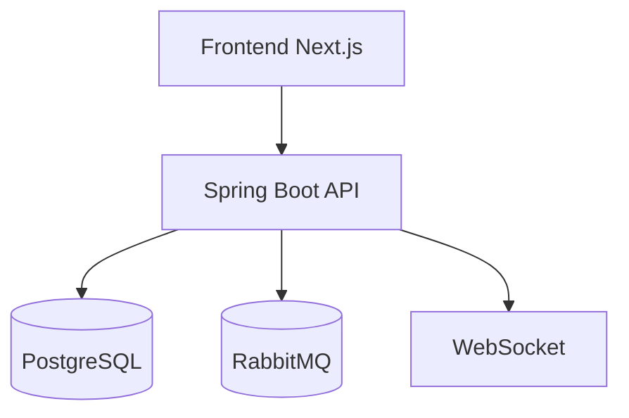

# Звіт про практику

**За темою бакалаврської кваліфікаційної роботи:**  
*«Розроблення CRM-системи для малого бізнесу з інтегрованим LLM-асистентом та підтримкою MCP-протоколу»*

| Поле | Значення |
|------|----------|
| Виконав | Карпляк Василь Володимирович |
| Група | ПП-46 |
| База практики | [повна назва підприємства / підрозділу, місто] |
| Керівник практики від бази | [ПІБ, посада] |
| Керівник практики від ЗВО | Ігор Фармага |
| Термін практики | 20.04.2026 – 09.05.2026 |
| Рік | 2026 |

## Вступ

Актуальність теми визначається сучасним станом цифровізації малого бізнесу, у якому ключові процеси взаємодії з клієнтами часто залишаються фрагментованими. На практиці інформація про контакти, домовленості, етапи продажів і поточні задачі розподіляється між окремими таблицями, електронною поштою, месенджерами та особистими нотатками менеджерів. У результаті ускладнюється контроль за воронкою продажів, збільшується ймовірність втрати лідів, виникає дублювання записів, а керівник не отримує оперативної аналітичної картини щодо поточного стану роботи з клієнтами.

Додатковий контекст актуальності полягає в активному розвитку великих мовних моделей (LLM), які поступово переходять від ролі текстового консультанта до ролі інтелектуального операційного помічника. У CRM-системах це відкриває можливість не лише отримувати пояснення або рекомендації, а й виконувати прикладні дії в системі: створювати задачі, змінювати статуси угод, формувати короткі аналітичні зведення, працювати з історією взаємодій.

Особливу значущість для бакалаврської роботи має підтримка **Model Context Protocol (MCP)**. Використання MCP-підходу формує технічну основу для сумісності із зовнішніми агентними клієнтами в майбутньому та забезпечує розширюваність системи без дублювання доменної логіки.

**Мета практики** — розробити й обґрунтувати архітектурно цілісну CRM-систему для малого бізнесу з інтегрованим LLM-асистентом і підтримкою MCP, а також зафіксувати результати проєктування, реалізації та перевірки системи у звіті.

**Завдання практики:**

1. Проаналізувати предметну область CRM для малого бізнесу.
2. Обґрунтувати технологічний стек і архітектуру.
3. Реалізувати ключові модулі backend і frontend.
4. Інтегрувати AI-асистента через tool calling.
5. Забезпечити роботу фонових процесів (звітність, вкладення).
6. Описати контрольні сценарії тестування.

## Розділ 1. Теоретичні засади та узгодження з базою практики

### 1.1. Короткий опис бази практики

[Додайте конкретику про вашу базу практики: підрозділ, процеси, що автоматизувалися, проблеми до впровадження.]

### 1.2. Характеристика предметної області

Предметною областю є автоматизація процесів взаємодії малого бізнесу з клієнтами на всіх етапах життєвого циклу угоди: від першого звернення до завершення продажу й повторних контактів.

### 1.3. Характеристика технологій і засобів

- **Backend:** Java 21, Spring Boot 3.4, Spring Data JPA, Spring AI, RabbitMQ, PostgreSQL.
- **Frontend:** Next.js 16, React 19, TypeScript, TanStack Query, Zustand, Tailwind CSS.
- **Інтеграції:** WebSocket, Email/Telegram, MCP (SSE), pgvector (опційно).

### 1.4. Висновки до розділу 1

Обраний стек і архітектура відповідають вимогам до CRM-системи малого бізнесу та забезпечують основу для AI-розширень і подальших інтеграцій.

## Розділ 2. Вимоги, проєктування та перевірка системи

### 2.1. Функціональні вимоги

- IAM: автентифікація, ролі, користувачі, організації, проєкти.
- Sales: клієнти, угоди, події, задачі.
- Communications: чати, email, Telegram webhook, нотифікації.
- AI: глобальний чат, історія, tool calling.
- Attachments/Reporting/Search: вкладення, звіти, семантичний пошук.

### 2.2. Нефункціональні вимоги

- ізоляція даних за `X-Project-Id`;
- стабільність фонової обробки;
- підтримка real-time оновлень;
- масштабованість і розширюваність.

### 2.3. Структурна схема

### 2.4. Контрольні приклади та тестування

1. Авторизація й доступ до дашборду.
2. CRUD клієнтів та угод.
3. Kanban-переміщення задач.
4. Отримання нотифікацій у реальному часі.
5. Формування та завантаження звітів.
6. Виконання AI-команди з фактичною зміною даних.

### 2.5. Висновки до розділу 2

Розроблені модулі працюють узгоджено, ключові сценарії підтверджено тестуванням.

## Загальні висновки

Мету практики досягнуто: реалізовано CRM-систему з модульною архітектурою, інтегрованим LLM-асистентом і підготовкою до MCP-сумісних інтеграцій. Результат має практичну цінність для автоматизації процесів малого бізнесу.

## Список використаних літературних джерел

1. Spring AI Documentation — https://docs.spring.io/spring-ai/reference/
2. Spring Boot Reference — https://docs.spring.io/spring-boot/docs/current/reference/html/
3. Model Context Protocol — https://modelcontextprotocol.io/
4. Next.js Documentation — https://nextjs.org/docs
5. PostgreSQL Documentation — https://www.postgresql.org/docs/
