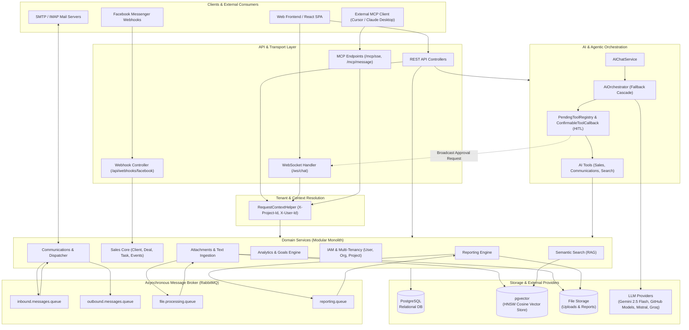
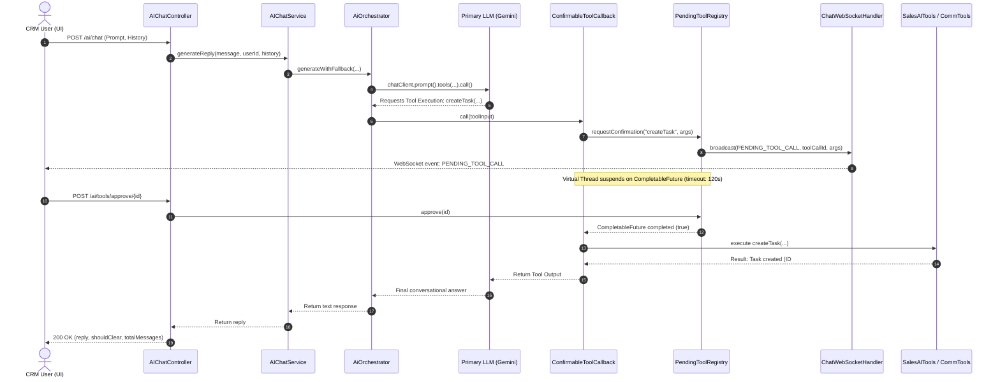
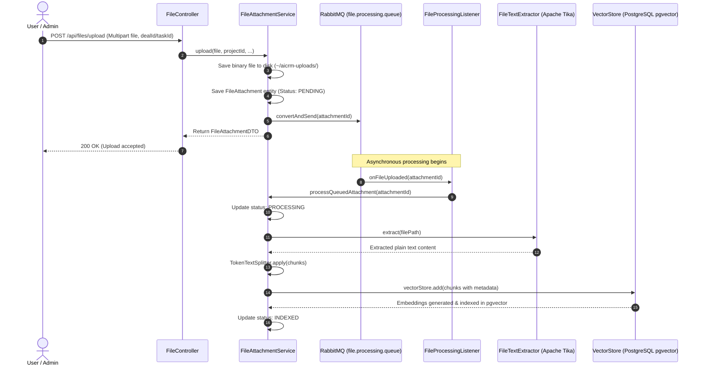
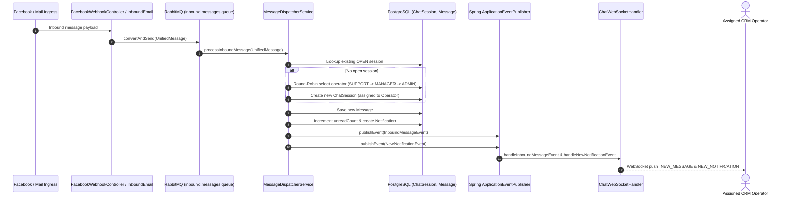

# aiCRM Backend Architecture Documentation

## 1. System Overview

**aiCRM** is an intelligent, multi-tenant Customer Relationship Management (CRM) backend built on **Spring Boot 3.4** and **Java 21**, deeply integrated with **Spring AI 1.1.5** and the **Anthropic Model Context Protocol (MCP)**.

The backend combines traditional CRM operational capabilities (sales pipeline, contacts, deals, tasks, reports) with advanced AI agentic capabilities:
- **Autonomous & Assisted Tool Calling**: AI agents can inspect and modify CRM data (tasks, deals, clients, communications) using specialized Spring AI tools.
- **Human-in-the-Loop (HITL) Execution Safeguard**: Potentially impactful tool invocations are suspended via Java 21 Virtual Threads and broadcast over WebSockets to frontends for operator approval or rejection.
- **Resilient Multi-Provider Fallback Engine**: Cascading automatic failover across multiple LLM providers (**Google Gemini** &rarr; **GitHub Models** &rarr; **Mistral AI** &rarr; **Groq**).
- **RAG & Unstructured Data Ingestion**: Asynchronous document processing pipeline using Apache Tika and PostgreSQL `pgvector` with HNSW cosine-distance indexing.
- **Model Context Protocol (MCP) Server**: Exposes internal CRM tools over Server-Sent Events (SSE) compliant with the MCP specification, enabling external AI desktop agents and IDEs (e.g., Cursor, Claude Desktop) to operate on CRM assets securely.
- **Event-Driven Asynchronous Processing**: RabbitMQ message brokers decouple omnichannel message ingress, file vectorization, and heavy report compilation from HTTP request cycles.

---

## 2. High-Level Architecture Diagram



---

## 3. Technology Stack & Runtime Environment

| Category | Technology / Library | Version / Details | Purpose |
| :--- | :--- | :--- | :--- |
| **Language & Runtime** | Java OpenJDK | 21 (LTS) | Modern language features, pattern matching, record types |
| **Concurrency Model** | Project Loom Virtual Threads | `spring.threads.virtual.enabled: true` | High-throughput, non-blocking SSE connections & blocking HITL approval waits |
| **Framework** | Spring Boot | 3.4.0 | Core DI container, configuration, auto-configuration |
| **AI Framework** | Spring AI | 1.1.5 | Model clients, prompt templating, tool execution, vector store abstraction |
| **AI Protocol** | Anthropic Model Context Protocol | `spring-ai-starter-mcp-server-webmvc` | Exposes CRM actions to external AI IDEs and agents via SSE |
| **Primary LLM** | Google GenAI | `gemini-2.5-flash` | Default conversational agent and tool executor |
| **Embeddings** | Google GenAI Embedding | `gemini-embedding-2` (768 dimensions) | Document vectorization for semantic search |
| **Fallback LLMs** | OpenAI-compatible APIs | GitHub Models (`gpt-4o-mini`), Mistral AI, Groq (`llama3-groq-70b`) | Automatic failover when primary limits or outages occur |
| **Relational Database** | PostgreSQL | 15+ with standard JDBC / Hibernate JPA | Relational entities, multi-tenancy relations, transaction control |
| **Vector Database** | pgvector | PostgreSQL Extension (HNSW index, Cosine distance) | Vector similarity search for RAG |
| **Message Broker** | RabbitMQ (Spring AMQP) | 3.12+ | Asynchronous queues for messages, file vectorization, reports |
| **Document Parser** | Apache Tika | 3.0.0 | Format-agnostic text extraction (PDF, DOCX, XLSX, TXT) |
| **Real-Time Layer** | Spring WebSocket | Pure WebSocket (`TextWebSocketHandler`) | Live chat updates, system notifications, tool approval requests |
| **API Documentation** | Springdoc OpenAPI UI | 2.8.0 (OpenAPI 3 / Swagger UI) | Interactive REST API catalog at `/swagger-ui.html` |
| **Metrics & Health** | Spring Actuator + Micrometer | Prometheus registry | Readiness/liveness probes, health monitoring, metrics export |
| **Quality & Formatting**| Spotless, Checkstyle, SpotBugs, JaCoCo, OWASP | Google Java Format, OWASP Dependency Check | Static analysis, automated formatting, vulnerability tracking |

---

## 4. Package Decomposition & Domain Architecture

The codebase follows a **modular-by-feature** architectural style rooted at `vasyl.karpliak.aiCRM`:

```
vasyl.karpliak.aiCRM
├── AiCrmApplication.java           # Spring Boot Application Entrypoint
├── ai/                             # Spring AI orchestration, LLM config, AI tools
├── analytics/                      # Sales funnel metrics, revenue targets, KPIs
├── attachments/                    # File upload, Apache Tika extraction, vector indexing
├── communications/                 # Omnichannel messaging, Facebook, Email, Dispatcher
├── iam/                            # Identity, Access Management, Multi-tenancy
├── reporting/                      # Asynchronous CSV generation engine
├── sales/                          # Core CRM (Clients, Deals, Tasks, Events)
├── search/                         # Semantic search and RAG querying
└── shared/                         # Cross-cutting configs, WebSocket, Exception handling, HITL
```

### 4.1. `iam` (Identity, Access Management & Multi-Tenancy)
- **Entities**:
  - `Organization`: The top-level tenant boundary.
  - `Project`: Scoping container within an Organization. All CRM data (clients, deals, tasks, files) belongs to a specific `Project`.
  - `User`: CRM operators and team members. Includes CRM roles (`ADMIN`, `MANAGER`, `ACCOUNT_MANAGER`, `MARKETING`, `SUPPORT`, `FINANCE`), Google OAuth2 tokens, and revenue target preferences.
- **Controllers & Services**:
  - `AuthController`: Traditional login and user registration.
  - `OAuth2Controller` & `SystemOAuth2Controller`: Handles Google OAuth2 callback flows and persists Gmail access/refresh tokens.
  - `ProjectController`, `OrganizationController`, `UserController`: Multi-tenant entity management.

### 4.2. `sales` (Core CRM Sales Domain)
- **Entities**:
  - `Client`: Customer profiles with company details, contact channels, and chronological notes (`client_notes`).
  - `Deal`: Sales pipeline deals categorized by stages (`NEW`, `QUALIFICATION`, `DELIVERY`, `DONE`, `LOST`) with budget and multi-currency tracking.
  - `DealEvent`: Activity log and audit timeline attached to a deal.
  - `Task`: Kanban-style work items (`PLANNED`, `IN_WORK`, `DONE`) associated with a user, client, and deal.
- **Integration Engine**:
  - `SalesIntegrationService`: Auto-creates or resolves clients and deals when inbound messages arrive via social or email channels, automatically adding messages to deal activity timelines.

### 4.3. `communications` (Omnichannel Messaging & Notification Engine)
- **Entities**:
  - `ChatSession`: Represents a conversation thread with a client on a channel (`ChannelType.FACEBOOK`, `EMAIL`, etc.) assigned to an operator.
  - `Message`: Individual messages within a session with sender classification (`CLIENT`, `OPERATOR`, `BOT`).
  - `Notification`: System alerts delivered to CRM users.
  - `Bot`: Channel connection configuration and credentials.
- **Routing & Event Flow**:
  - `FacebookWebhookController`: Verifies Facebook webhooks and captures incoming messages.
  - `InboundEmailService` & `MailService`: IMAP polling and JavaMailSender SMTP integration.
  - `MessageDispatcherService`: Listens on RabbitMQ `inbound.messages.queue`, manages round-robin operator assignments based on roles (`SUPPORT` &rarr; `MANAGER` &rarr; `ACCOUNT_MANAGER` &rarr; `ADMIN`), updates unread counters, and triggers Spring application events.

### 4.4. `ai` (AI Orchestrator & Tool Registry)
- **Core Components**:
  - `AiModelConfig`: Defines Spring AI chat models for Groq, GitHub Models, and Mistral.
  - `AiOrchestrator`: Implements the multi-provider fallback strategy (`Gemini` &rarr; `GitHub` &rarr; `Mistral` &rarr; `Groq`).
  - `AIChatService`: Prepares the CRM system prompt, injects conversation history, enforces native tool invocation semantics, and calls `AiOrchestrator`.
  - `AIChatController`: REST interface for `/ai/chat`, chat history persistence (`AiChatMessage`), and HITL decision triggers (`/ai/tools/approve/{id}`, `/ai/tools/reject/{id}`).
- **Tool Definitions** (`@Tool`):
  - `SalesAITools`: Kanban tasks retrieval/creation/modification, client search/creation/status updates, deal lifecycle management.
  - `CommunicationsAITools`: Sending emails, retrieving open Facebook chats, viewing chat history, replying directly to external messenger threads.
  - `SearchAITools`: Querying internal knowledge base via semantic vector search.

### 4.5. `attachments` (Document Parsing & Vector Ingestion)
- **Entities & Pipeline**:
  - `FileAttachment`: Metadata, storage path, processing status (`PENDING`, `PROCESSING`, `INDEXED`, `FAILED`), and foreign references to `DealEvent`, `Task`, or `Client`.
  - `FileController`: Multipart file upload endpoint.
  - `FileProcessingRabbitConfig` & `FileProcessingListener`: Asynchronous job consumer.
  - `FileTextExtractor`: Parses documents using Apache Tika into plain text.
  - Ingestion: Text is split via `TokenTextSplitter` into chunked Spring AI `Document` instances with metadata (`projectId`, `dealId`, `taskId`, `clientId`) and saved to `VectorStore`.

### 4.6. `search` (RAG & Semantic Retrieval)
- **Components**:
  - `SemanticSearchService`: Executes similarity search against `VectorStore` using cosine distance with top-K retrieval.
  - Metadata Isolation: Enforces multi-tenancy by filtering results matching the caller's `projectId`.
  - `SemanticSearchController`: REST endpoint `/api/search/semantic`.

### 4.7. `reporting` (Asynchronous Reporting Engine)
- **Components**:
  - `ReportTask`: Asynchronous report execution records (`PENDING`, `PROCESSING`, `COMPLETED`, `FAILED`).
  - `ReportingRabbitConfig` & `ReportGenerationListener`: RabbitMQ queue decoupling report requests from heavy generation.
  - `ReportingService`: Streams deal and client records into CSV format with UTF-8 BOM and semicolon delimiters for full Excel compatibility.
  - `ReportRequestController` & `ReportDownloadController`: Request creation and file download endpoints.

### 4.8. `analytics` (Business Intelligence & Metrics)
- **Components**:
  - `AnalyticsService`: Aggregates deal stage distribution (`getFunnel`), user revenue targets vs. achieved revenue (`getGoals`), and currency conversions.
  - `AnalyticsController`: Exposes analytical metrics to the dashboard.

### 4.9. `shared` (Infrastructure & Cross-Cutting Concerns)
- **Components**:
  - `RequestContextHelper`: Extracts `X-Project-Id` and `X-User-Id` HTTP headers from the servlet thread.
  - `ChatWebSocketHandler`: Manages active WebSocket connections at `/ws/chat`, broadcasting new chat messages, system notifications, and HITL tool approval requests.
  - `PendingToolRegistry`: Thread-safe registry holding `CompletableFuture<Boolean>` instances for pending tool execution confirmations.
  - `ConfirmableToolCallbackProvider` & `ConfirmableToolCallback`: Wraps Spring AI tool callbacks to intercept tool calls for human approval.
  - `McpConfig`: Builds the Spring AI MCP ToolCallbackProvider, exposing CRM tools to external MCP clients over SSE.
  - `PgVectorExtensionInitializer`: Automatically runs `CREATE EXTENSION IF NOT EXISTS vector` and creates the `vector_store` table schema on application startup.
  - `GlobalExceptionHandler`: Centralized REST error handling and standardized JSON error responses.

---

## 5. Key Architectural Workflows & Sequences

### 5.1. AI Chat with Human-in-the-Loop (HITL) Tool Execution



### 5.2. Asynchronous Document Ingestion Pipeline (RAG)



### 5.3. Omnichannel Inbound Message Dispatching



---

## 6. Multi-Tenant Data Isolation Strategy

Multi-tenancy in aiCRM follows a shared-database, discriminator-column model:
- **Tenant Hierarchy**: `Organization` (1) &rarr; `Project` (N) &rarr; `Domain Entities` (N).
- **Request Identification**: Incoming HTTP requests specify the project context via the `X-Project-Id` header (and user identity via `X-User-Id`).
- **Context Accessor**: `RequestContextHelper.getCurrentProjectId()` resolves the tenant context statically from the active `HttpServletRequest`.
- **Query Scoping**: Service layers enforce project-level filtering:
  ```sql
  SELECT * FROM deal WHERE project_id = :projectId;
  SELECT * FROM client WHERE project_id = :projectId;
  ```
- **Vector Store Isolation**: Vector documents stored in `pgvector` include a `projectId` metadata key. `SemanticSearchService` explicitly filters vector similarity search hits to match the caller's `projectId`, preventing cross-tenant information leakage.

---

## 7. Model Context Protocol (MCP) Architecture

The backend implements the **Anthropic Model Context Protocol (MCP)** specification via `spring-ai-starter-mcp-server-webmvc`:
- **Transport**: Server-Sent Events (SSE) over HTTP.
- **Endpoints**:
  - SSE Connection: `GET /mcp/sse`
  - Message Post: `POST /mcp/message`
- **Exposed Tool Registry**:
  Through `McpConfig`, all internal CRM tools (`SalesAITools`, `CommunicationsAITools`, `SearchAITools`) are exposed to external MCP clients (Cursor, Claude Desktop, autonomous worker agents).
- **Security & Safety**:
  Because MCP tool callbacks are wrapped in `ConfirmableToolCallbackProvider`, external MCP agents cannot perform write operations without triggering the same interactive human approval process on the frontend.

---

## 8. Summary of API Endpoints

| Module | Route Prefix | Method / Sub-paths | Description |
| :--- | :--- | :--- | :--- |
| **AI** | `/ai` | `POST /chat`<br>`GET /history`, `DELETE /history`<br>`POST /tools/approve/{id}`, `POST /tools/reject/{id}` | Conversational assistant, history management, and HITL tool approval |
| **MCP Server** | `/mcp` | `GET /sse`<br>`POST /message` | Model Context Protocol SSE transport and client messaging |
| **Sales** | `/clients`<br>`/deals`<br>`/tasks` | CRUD endpoints with project filtering | Clients database, deal pipeline stages, Kanban tasks |
| **Communications** | `/chats`<br>`/mail`<br>`/notifications`<br>`/api/webhooks/facebook` | REST chats list, email sender, notification inbox, Facebook Webhook | Unified messaging, channel adapters, and notifications |
| **Attachments** | `/api/files` | `POST /upload`<br>`GET /project`<br>`DELETE /{id}` | File attachment management and vector ingestion trigger |
| **Search** | `/api/search` | `GET /semantic` | Vector similarity RAG query endpoint |
| **Reporting** | `/api/reports` | `POST /request`<br>`GET /project`<br>`GET /download/{id}` | Asynchronous CSV report generation and export |
| **Analytics** | `/analytics` | `GET /funnel`<br>`GET /goals`, `PUT /goals` | Deal conversion funnel and revenue target tracking |
| **Dashboard** | `/dashboard` | `GET /stats` | Aggregated dashboard KPI counters |
| **IAM** | `/iam`, `/auth` | `/login`, `/register`<br>`/oauth2/google/**`<br>`/users`, `/organizations`, `/projects` | Authentication, Google OAuth2, tenant and user management |
| **WebSocket** | `/ws/chat` | WebSocket handshake | Bi-directional streaming for chat, notifications, and HITL |
| **Actuator** | `/actuator` | `/health`, `/info`, `/prometheus` | Production observability and Kubernetes probes |
